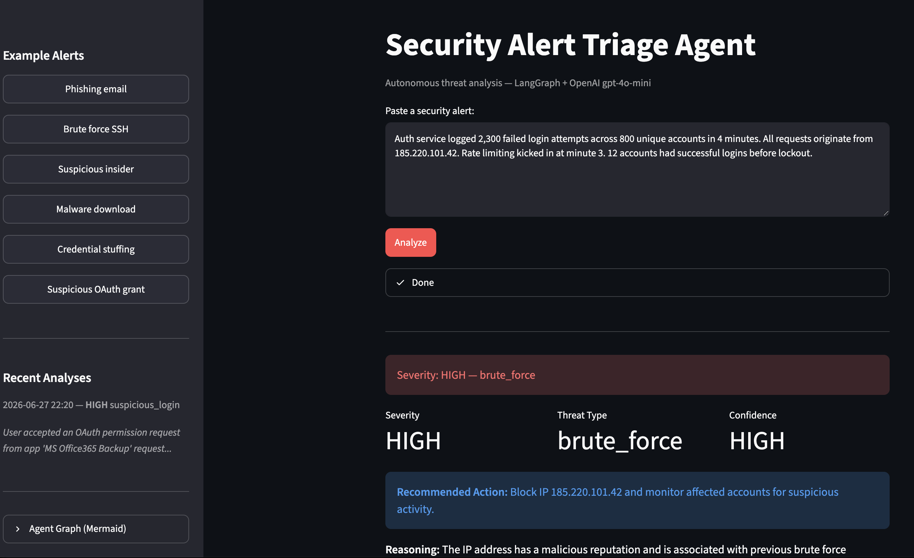

# Security Alert Triage Agent

I built this to show what a real-world security triage workflow looks like when you give it a brain.

The agent takes a raw security alert - a phishing email, a brute-force attempt, a suspicious login - and autonomously investigates it using a loop of LLM reasoning and tool calls, then outputs a structured report with severity, recommended action, and reasoning.

This is the kind of thing I would assume Ontinue's team does manually at scale. Wanted to see what it looks like when you automate it with LangGraph.

> The OpenAI structured output schemas (the part that makes the LLM return clean JSON every time) were worked out with [Claude Sonnet 4.6](https://www.anthropic.com/claude) - getting `additionalProperties: false` right across nested Pydantic models was not fun to debug alone...

---

## How it works

```
Alert Input
    │
    ▼
[classify]  ──  LLM identifies threat type
    │
    ▼
[select_tool]  ──  LLM picks the next tool to call (loops up to 3x)
    │   ▲
    │   └── (loop back if more context needed)
    ▼
[report]  ──  LLM generates structured triage report
    │
    ▼
Output: severity / recommended action / reasoning
```

The loop is the key part. The agent doesn't just classify once - it decides what information it still needs, calls a tool, and re-evaluates. That's what LangGraph is designed for.

Tools:
- `lookup_ip_reputation` - hits the real [AbuseIPDB API](https://www.abuseipdb.com) if a key is set, falls back to mock otherwise
- `check_email_headers` - parses SPF/DKIM/DMARC signals
- `search_past_incidents` - searches simulated incident history

---



---

## Features

- **Live streaming** - watch each agent step fire in real time (classify → tool calls → report)
- **Severity color coding** - green/yellow/red based on risk level
- **Investigation trail** - see exactly which tools the agent called and what they returned
- **Alert history** - last 20 analyses saved locally, shown in sidebar
- **Download report** - export any triage result as JSON
- **Agent graph** - sidebar shows the LangGraph graph as Mermaid source (paste at mermaid.live to visualize)
- **6 example alerts** - phishing, brute force, insider threat, malware, credential stuffing, OAuth abuse

---

## Stack

- **[LangGraph](https://github.com/langchain-ai/langgraph)** - stateful agent graph
- **[OpenAI](https://platform.openai.com)** - `gpt-4o-mini` (fast & cheap)
- **[AbuseIPDB](https://www.abuseipdb.com)** - real IP reputation lookups (optional, free tier)
- **[Streamlit](https://streamlit.io)** - UI

---

## Run it locally

I use [uv](https://github.com/astral-sh/uv) - it's faster than pip and handles virtualenvs cleanly.

**1. Clone and install**

```bash
git clone https://github.com/MMchaouri/langgraph-security-agent.git
cd langgraph-security-agent
uv venv && source .venv/bin/activate
uv pip install -r requirements.txt
```

**2. Set your API keys**

Create a `.env` file:

```
OPENAI_API_KEY=your_key_here
ABUSEIPDB_API_KEY=your_key_here   # optional - free at abuseipdb.com
```

**3. Launch**

```bash
streamlit run app.py
```

---

## Example alerts to try

**Phishing:**
> User reported a suspicious email from 'security@paypa1.com' asking to verify account. Email headers show SPF fail, DKIM invalid, sender domain registered 2 days ago.

**Brute force:**
> 47 failed SSH login attempts from IP 185.220.101.42 against user 'root' on prod-server-01 between 03:12-03:19 UTC. One successful login at 03:19 UTC.

**Malware download:**
> Endpoint detection flagged process 'svchost32.exe' making outbound connections to 185.220.101.42:4444. Process spawned from chrome.exe after user visited a suspicious URL.

**Credential stuffing:**
> Auth service logged 2,300 failed login attempts across 800 unique accounts in 4 minutes. All from the same IP. 12 accounts had successful logins before lockout.

**OAuth abuse:**
> User accepted an OAuth permission request from unverified app 'MS Office365 Backup' requesting Mail.ReadWrite and Files.ReadWrite.All scopes. App registered 3 days ago.

---

## Why LangGraph and not a simple chain?

A chain runs once. This agent needs to loop - it might call one tool, realize it needs another, then decide it has enough to report. LangGraph's stateful graph makes that explicit and controllable. I can see exactly what path the agent took, how many iterations it ran, and what it found at each step.
